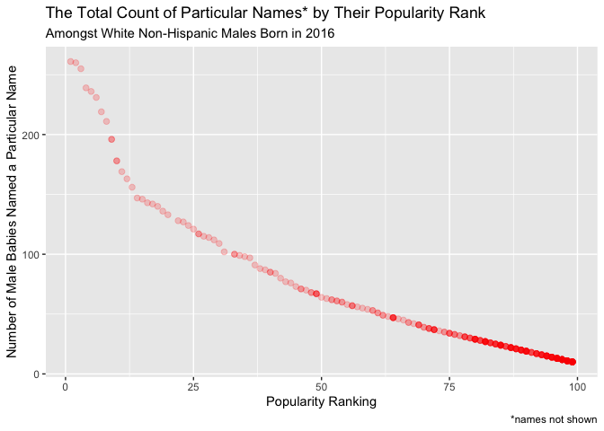
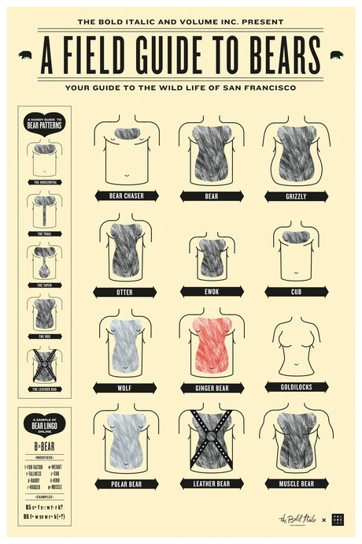

Data Science - Homework \#2
================
Jon Brock - JPB2210

  - [Problem \#1](#problem-1)
  - [Problem \#2](#problem-2)
  - [Problem \#3](#problem-3)
  - [Bonus Content](#bonus-content)

> *“A man will be imprisoned in a room with a door that’s unlocked and
> opens inwards; as long as it does not occur to him to pull rather than
> push.” - Ludwig Wittgenstein*

``` r
library(tidyverse)
library(readxl)
```

-----

## Problem \#1

###### (*25 points*)

##### *Read and clean the Mr. Trash Wheel sheet:*

The following code imports the designated excel file, specifically the
sheet named “Mr. Trash Wheel.” There is a graphic displayed in the first
row of the sheet, so I opted to skip that row when importing.
Thereafter, I cleaned the column/variable names by converting them into
the ever sexy “snake\_case.” Then I dropped the column that contained
notes and removed all the rows that did not have dumpster-specific data.
Lastly, I rounded the variable `sports_balls` to the nearest integer and
mutated it from a `dbl` to an `int`.

``` r
mr_tw_df <-
    read_excel("./data/Trash-Wheel-Collection-Totals-8-6-19.xlsx", 
               sheet = "Mr. Trash Wheel", skip = 1) %>% 
    janitor::clean_names() %>% 
    select(-x15, -x16, -x17) %>% 
    drop_na(dumpster) %>% 
    mutate(
        sports_balls = as.integer(
            round(sports_balls, digits = 0)))
```

The following code imports the designated excel file, specifically the
sheet named “2017 Precipitation.” There is no graphic in this sheet, but
there is an additional row of header text; I skipped that row when
importing. Thereafter, I cleaned the column names as before, removed
rows with missing data in the `month` column, and added a new column:
`year` with `2017` as its observations.

``` r
precip_2017 <-
    read_excel("./data/Trash-Wheel-Collection-Totals-8-6-19.xlsx", 
               sheet = "2017 Precipitation", skip = 1) %>%
    janitor::clean_names() %>% 
    drop_na(month) %>% 
    mutate(year = "2017")
```

The following code does everything that the previous code does, with
some small changes. The sheet named “2018 Precipitation” was imported,
and the addition of the `year` column reflected `2018` as its
observations.

``` r
precip_2018 <-
    read_excel("./data/Trash-Wheel-Collection-Totals-8-6-19.xlsx", 
               sheet = "2018 Precipitation", skip = 1) %>%
    janitor::clean_names() %>% 
    drop_na() %>% 
    mutate(year = "2018")
```

The following code binds both the `precip_2017` and `precip_2018`
tibbles into one, mutates the `month` vector from a `dbl` to a `chr`,
and arranges them as such: `year` \> `month` \> `total`.

``` r
precip_1718 <-
    bind_rows(precip_2017, precip_2018) %>% 
    mutate(month = month.name[month]) %>% 
    select(year, month, total)
```

Let’s give a brief rundown on our tibbles: In `2017` there were 11
months that had precipitation, though we had data for all months. In
`2018`, of the 12 months’ worth of data there were 12 months with
precipitation. The `precip_2017` tibble had a reported total
precipitation of 32.93 inches. The `precip_2018` tibble had a reported
total precipitation of 70.33 inches. There was a net decrease of -37.4
inches from `2017` to `2018`. The `mr_tw_df` had far more information
than the two aforementioned tibbles. (14 columns vs. 3 and 3 columns,
respectively.) That tibble included key variables such as: `dumpster`,
`plastic_bottles`, `cigarette_butts`, `grocery bags`, and
`sports_balls`, which, what is a sports ball? (Anyone?) Regardless of
what it is, in `2017` the median number of `sports_balls` in a dumpster
was 8 balls.

-----

## Problem \#2

###### (*25 points*)

##### *Read and Merge 538.com Datasets:*

The following code imports the three 538.com (.csv) datasets into our
working environment.

``` r
pols_month <- read_csv("./data/pols-month.csv")
unemployment <- read_csv("./data/unemployment.csv")
snp <- read_csv("./data/snp.csv")
```

The following code pertains to the `pols_month` data. We separate the
singular `mon` variable into its component parts of `year`, `month`, and
`day`. This makes for much easier data cleaning. And to reduce clutter
and unnecessary observations, we integrate the logical values of
`prez_dem` and `prez_gop` into a single column `president`. It is now
easier to identify when the president in office was either a Republican
(`gop`) or Democrat (`dem`) based on their recoded values. And lastly,
we drop the columns we no longer need: `prez_gop`, `prez_dem`, and
`day`. \[Note: there was no cleaning of variable names needed for this
dataset\]

``` r
pols_month <- 
    pols_month %>% 
    separate(
        mon, into = (c("year", "month", "day")), remove = TRUE, convert = TRUE) %>%
    mutate(
        month = month.name[month],
        prez_dem = if_else(prez_dem == 1, "dem", "gop"),
        president = prez_dem) %>%
    select(-c(prez_gop, prez_dem, day))
```

The following code pertains to the `snp` data. Again, we separate the
singular `date` variable into its component parts of `year`, `month`,
and `day`. And then we utilize an R constant `month.name[]` to recode
our new `month` variable to apply the month names to the observations.
Lastly, we arrange our columns to match the order of `pols_month`:
`year`, `month`, `close`. This will make our joining of datasets process
work smoothly in the coming steps. We also dropped the unneeded `day`
variable. Sorry, `day`. \[Note: there was no cleaning of variable names
needed for this dataset\]

``` r
snp <-
    snp %>%
    separate(date, into = (c("month", "day", "year")), remove = TRUE, convert = TRUE) %>%
    mutate(month = month.name[month]) %>%
    select(year, month, close, -day)
```

The following code includes some additional data wrangling, as compared
to the two previous code chunks. This code pertains to the
`unemployment` data. We shift our data to be more tidy by pulling the
month (`Jan:Dec`) columns down to rows. Additionally, we have to do some
data acrobatics to get the months converted to integers, then month
abbreviations, and then month names. It was rough, but we got there.
Lastly, we cleaned up the variable names.

``` r
unemployment <-
    unemployment %>%
    pivot_longer(
        Jan:Dec,
        names_to = "Month",
        values_to = "Pct_Unemp") %>%
    mutate(
        Year = as.integer(Year),
        Month = match(Month, month.abb),
        Month = month.name[Month]) %>%
    janitor::clean_names()
```

The following code pertains to all three of the imported and cleaned
538.com datasets. First, we join the `snp` data into the `pols_month`
via a `left_join()` because we want to add values from `snp` into
`pols_month`. We match by both `year` and `month`. Next, we repeat the
same process, except that `unemployment` will now be joined to the
previously joined dataset `pols_snp`. The final product is a combined,
cleaned, and tidy `pols_snp_unemp` dataset.

``` r
pols_snp <- left_join(pols_month, snp, by = c("year", "month"))
pols_snp_unemp <- left_join(pols_snp, unemployment, by = c("year", "month"))
```

What we have here are three separate datasets (`pols_months`, `snp`, and
`unemployment`) containing US political office, stock market, and
unemployment data on the national level. (Side note: 538 nailed every
election prediction until…well, you know.) The `pols_month` dataset
(after cleaning) contained 9 variables, which included data on the
overall count of political representation in both the Legislative and
Executive branches of government for any given month and year. The year
range for the data covered from 1947 through 2015.

-----

## Problem \#3

###### (*25 points*)

##### *BABY NAMES\! BABY NAMES\! BABY NAMES\!:*

The following code thoroughly cleans, mutates, and coerces the dataset
concerning popular [baby names](https://youtu.be/JAfSjh6_2Jk?t=54). We
remove duplicates by converting `childs_first_name` to the same case,
and account for the different character descriptions for the same
ethnicity (i.e., `asian and paci` vs. `asian and pacific islander`) by
way of a simple recode. Lastly, we remove all the duplicate rows where
`year_of_birth`, `ethnicity`, and `childs_first_name` match other rows.

``` r
baby_data <-
    read_csv("./data/Popular_Baby_Names.csv") %>%
    janitor::clean_names() %>%
    mutate(
        childs_first_name = str_to_lower(childs_first_name),
        ethnicity = str_to_lower(ethnicity),
        ethnicity = as.factor(ethnicity),
        ethnicity = recode(ethnicity, 
                        "asian and paci" = "asian and pacific islander",
                        "black non hisp" = "black non hispanic",
                        "white non hisp" = "white non hispanic"),
        gender = str_to_lower(gender),
        gender = as.factor(gender),
        year_of_birth = as.integer(year_of_birth)) %>% 
    distinct(year_of_birth, ethnicity, childs_first_name, .keep_all = TRUE)
```

The following code sets us up to generate a table showing the ranking of
the name `Olivia` among each of the four ethnicities for the years 2011
through 2016.

``` r
baby_data_olivia <-
    filter(baby_data, childs_first_name == "olivia") %>%
    select(-c("gender", "childs_first_name", "count")) %>% 
    pivot_wider(
        names_from = "year_of_birth",
        values_from = "rank") %>% 
    knitr::kable(align = 'c')
```

This simple call generates our nice and tidy table for Olivia.

``` r
baby_data_olivia
```

|         ethnicity          | 2016 | 2015 | 2014 | 2013 | 2012 | 2011 |
| :------------------------: | :--: | :--: | :--: | :--: | :--: | :--: |
| asian and pacific islander |  1   |  1   |  1   |  3   |  3   |  4   |
|     black non hispanic     |  8   |  4   |  8   |  6   |  8   |  10  |
|          hispanic          |  13  |  16  |  16  |  22  |  22  |  18  |
|     white non hispanic     |  1   |  1   |  1   |  1   |  4   |  2   |

The following code sets us up to generate a table showing the most
popular `male` names among each of the four ethnicities for the years
2011 through 2016.

``` r
baby_data_males <-
    filter(baby_data,
        rank == 1,
        gender == "male") %>%
    select(-c("gender", "count", "rank")) %>% 
    pivot_wider(
        names_from = "year_of_birth",
        values_from = "childs_first_name") %>% 
    knitr::kable(align = 'c')
```

This simple call generates our nice and tidy table for Males.

``` r
baby_data_males
```

|         ethnicity          |  2016  |  2015  |  2014  |  2013  |  2012  |  2011   |
| :------------------------: | :----: | :----: | :----: | :----: | :----: | :-----: |
| asian and pacific islander | ethan  | jayden | jayden | jayden |  ryan  |  ethan  |
|     black non hispanic     |  noah  |  noah  | ethan  | ethan  | jayden | jayden  |
|          hispanic          |  liam  |  liam  |  liam  | jayden | jayden | jayden  |
|     white non hispanic     | joseph | david  | joseph | david  | joseph | michael |

The following code generates a scatterplot showing the number of
children with a name against the rank in popularity of that name, after
filtering for `white non hispanic`, `male`, and `2016` as the
`year_of_birth`.

``` r
baby_data_plot <-
    filter(baby_data,
           ethnicity == "white non hispanic",
           gender == "male",
           year_of_birth == 2016)

bdp <- ggplot(baby_data_plot, aes(x = rank, y = count))  + geom_point()
bdp + labs(
    title = "The Total Count of Particular Names by Their Popularity Rank",
    subtitle = "Amongst White Non-Hispanic Males Born in 2016",
    x = "Popularity Ranking",
    y = "Number of Male Babies Named a Particular Name")
```



-----

## Bonus Content

A handy guide for if you visit San Francisco. Bears can be vicious and
unpredictable\! Better to be prepared than not.

<center>



</center>
